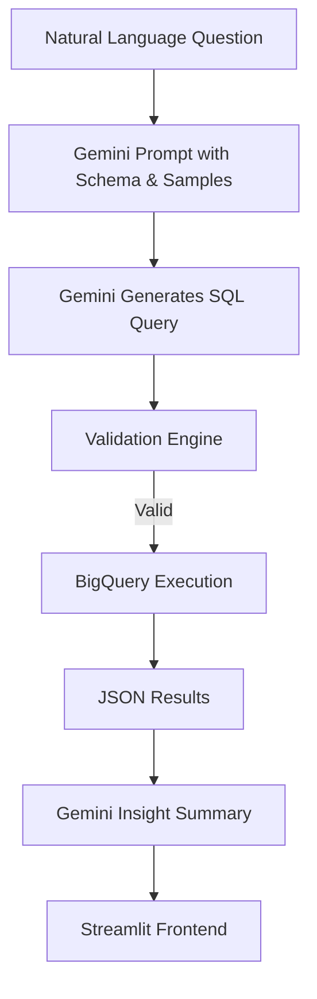

# BigQuery Natural Language to SQL Assistant (Gemini 2.0 Flash)

This project is a Streamlit-based assistant that enables users to ask questions in natural language and receive relevant insights, SQL queries, and visualizations from Google BigQuery public datasets. It uses Gemini 2.0 Flash from Vertex AI for natural language understanding, SQL generation, and insight summarization.

---

## Features

### 1. Natural Language to SQL (NL2SQL)
- Converts user questions like  
  _"How many noise complaints were reported in 2023?"_  
  into correct BigQuery SQL.
- Schema and sample rows from the BigQuery public dataset are injected into the Gemini prompt for high accuracy.

### 2. SQL Validation
- Each generated SQL is passed through a strict validation step:
  -  Correct BigQuery syntax
  -  All referenced fields exist in the schema
  -  Avoids querying null values or nonsensical aggregations

###  3. Result Execution
- Verified SQL is executed on:
  ```
  bigquery-public-data.san_francisco_311.311_service_requests
  ```
- Results are displayed in an interactive table.

###  4. Insight Generation
- Raw JSON output is passed back into Gemini to summarize key insights using a well-structured prompt.
- Handles edge cases like a single-value result, and interprets it meaningfully with unit-aware formatting.

###  5. Chart Generation (Optional)
- Generates basic charts (bar/line/pie) using Plotly based on the output structure (numerical or categorical).

---

##  Architecture



---

##  Example Question & Flow

> **Question**: "How many requests were made in 2022 for graffiti removal?"

1. Gemini Prompt (includes table schema + 10 sample rows)
2. SQL Generated:
   ```sql
   SELECT COUNT(*) AS request_count
   FROM `bigquery-public-data.san_francisco_311.311_service_requests`
   WHERE requested_datetime BETWEEN '2022-01-01' AND '2022-12-31'
     AND service_subtype = 'Graffiti'
   ```
3. Validation Passes 
4. SQL Executed in BigQuery
5. Response JSON Parsed → Insight:
   > "There were 45,873 graffiti removal requests made in 2022."

6. Chart Displayed (bar chart for year vs. count if multiple years detected)

---

###  Run the App

```bash
streamlit run app.py
```

---

## Project Structure

```

├── app.py                     # Main Streamlit app
├── prompt_sql_gen.py          # SQL generation prompt logic
├── prompt_insights.py         # Insight generation prompt logic
├── sql_verifier.py            # SQL syntax and logic validation
├── chart_generator.py         # Plotly-based chart rendering
├── bigquery_utils.py          # Functions for schema and sample retrieval
```

---

## Technologies Used

- **Gemini 2.0 Flash** (Vertex AI) — NL to SQL, insights
- **Google BigQuery** — Data source
- **Streamlit** — Frontend UI
- **Plotly** — Chart rendering
- **Pandas / JSON** — Data manipulation

---

## Highlights

-  Supports complex user questions with multiple filters
-  Gemini prompts optimized for few-shot schema understanding
-  Strong safety and correctness validation before query execution
-  Insight summaries feel like human-written analyst reports

---

## Future Enhancements

- Support more public datasets via dropdown
- Store user queries and responses for feedback learning
- Multi-row chart insights with Gemini explanation

---

##  Acknowledgments

- San Francisco Open Data (311 dataset)
- Google BigQuery Public Datasets

